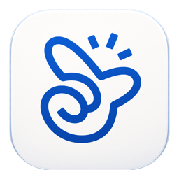
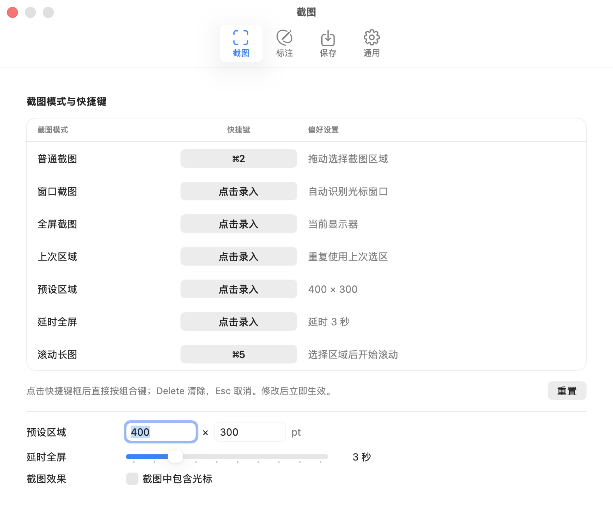

<p align="center">
  
</p>

<h1 align="center">Screen Capture for macOS</h1>

<p align="center">
  A private-by-design, native screenshot and scrolling-capture utility.<br>
  Retina pixels in, clean PNGs out.
</p>

<p align="center">
  <a href="README.zh-CN.md">简体中文</a> ·
  <a href="docs/PRIVACY.md">Privacy</a> ·
  <a href="CONTRIBUTING.md">Contributing</a> ·
  <a href="LICENSE">Apache-2.0</a>
</p>

## Why Screen Capture?

Screen Capture is built for two everyday jobs: a fast annotated screenshot and a reliable long screenshot. It is a real native macOS app made with Swift, SwiftUI, AppKit, ScreenCaptureKit, Vision, and Core Graphics—without web views, accounts, analytics, uploads, or third-party runtime dependencies.

## Highlights

- Region, window, full-screen, previous-area, preset-size, and delayed capture
- Retina-native capture with lossless PNG export by default
- Compact inline annotation: rectangle, ellipse, line, tapered arrow, pen, spotlight, and text
- Global color and line-width controls, selection editing, undo, and redo
- Adjustable capture region with clear outside dimming and four resize handles
- Scrolling capture with a live viewport, borderless stitched preview, sticky-header handling, and fast-scroll recovery
- Bounded long-image memory use, deterministic stitching, and cancellation with `Escape`
- Menu-bar controls, editable global shortcuts, and silent launch
- Local-only processing and a declared privacy manifest

Screen recording, audio recording, translation, OCR, accounts, telemetry, and cloud upload are intentionally out of scope.

<p align="center">
  
</p>

<p align="center"><em>Native settings and editable shortcuts. The current application interface is Simplified Chinese.</em></p>

## Project status

`0.4.8` is the current public-release candidate for this independently maintained personal open-source project. The source builds and its automated suite pass on macOS, but downloadable releases are not considered official until they are Developer ID signed, notarized, stapled, and verified with Gatekeeper.

## Requirements

- macOS 14 or later
- Xcode 26 or later for development
- Screen Recording permission when the first capture starts

## Build and run

Open `ScreenCapture.xcodeproj`, select your own development team if Xcode requests one, then press `Command-R`.

For a signing-independent command-line build:

```sh
DEVELOPER_DIR=/Applications/Xcode.app/Contents/Developer xcodebuild \
  -project ScreenCapture.xcodeproj \
  -scheme ScreenCapture \
  -destination 'platform=macOS' \
  CODE_SIGNING_ALLOWED=NO build
```

The app launches quietly and remains available from both the Dock and menu bar. macOS asks for Screen Recording permission only when capture is first requested. If the permission was just changed, return to the app and try again.

## Default shortcuts

| Action | Shortcut |
| --- | --- |
| Region capture | `Command-4` |
| Scrolling capture | `Command-5` |
| Cancel any active capture | `Escape` |

All capture shortcuts can be changed in **Settings → Capture**.

## Test

```sh
./scripts/ci.sh
```

The validation script checks property lists, runs the complete unit-test suite, performs Xcode static analysis, and produces an unsigned universal Release build. See [release checks](docs/RELEASE_CHECKLIST.md) and [distribution](docs/DISTRIBUTION.md) for the remaining manual, signing, and notarization gates.

## Known limitations

- Scrolling capture needs repeated visual overlap. Video, rapidly animated pages, large horizontal movement, or content that redraws every frame may prevent a reliable stitch.
- Screen Recording permission is a macOS requirement even though the app never records video.
- UI and permission flows still require manual testing because macOS does not expose every system interaction to unit tests.
- The current application interface is Simplified Chinese; repository documentation is bilingual.

## Repository layout

- `ScreenCapture/App`: lifecycle and menu-bar integration
- `ScreenCapture/Capture`: capture coordination and adjustable selection
- `ScreenCapture/Annotation`: non-destructive annotation editor
- `ScreenCapture/LongCapture`: stream collection, alignment, and stitching
- `ScreenCapture/Services`: export, permissions, hot keys, and system integration
- `ScreenCapture/Settings`: persisted preferences
- `ScreenCaptureTests`: deterministic unit and regression tests
- `scripts`: CI and direct-distribution helpers
- `docs`: architecture, privacy, product scope, and release process

## Contributing and security

Read [CONTRIBUTING.md](CONTRIBUTING.md) before opening a pull request. Please report security or privacy issues privately as described in [SECURITY.md](SECURITY.md), not in a public issue.

## License

Licensed under the [Apache License 2.0](LICENSE).

Screen Capture is an independent personal project and is not affiliated with or endorsed by Apple or iShot.
